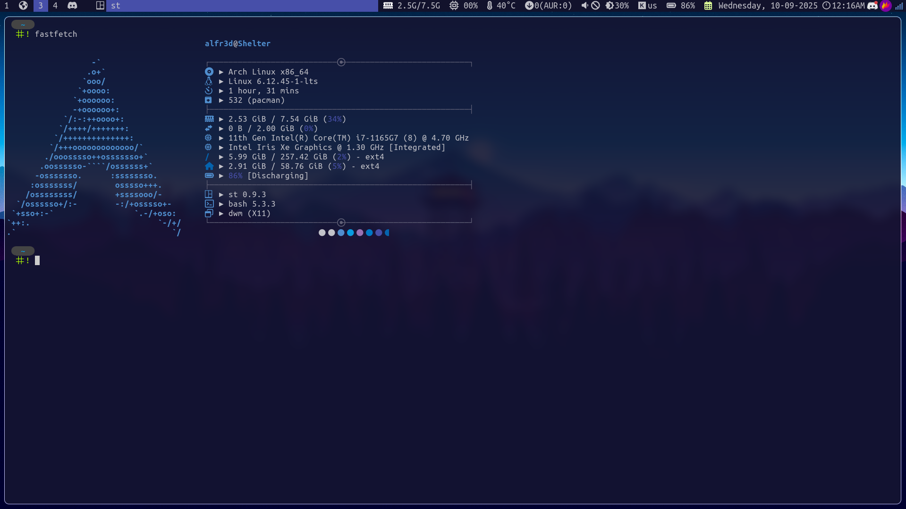

# dwm



# Requeriments compilation tools for:

## Arch

```bash
sudo pacman -S --noconfirm base-devel libx11 libxft libxinerama wget unzip
```

## Debian

```bash
sudo apt install -y build-essential libxft-dev libxinerama-dev libx11-dev wget unzip
```

## Void

```bash
sudo xbps-install -y base-devel libx11-devel libxft-devel libxinerama-devel wget unzip
```

## necessary

- xorg
- xorg-xinit or xinit
- dunst
- acpi
- brightnessctl
- pamixer
- pipewire
- lsd
- feh
- network-manager-applet
- pacman-contrib
- sensors
- pywal16
- network-manager-applet
- Font: UbuntuMono Nerd Font

# Tip

### Add in this path "/etc/X11/xorg.conf.d/30-touchpad.conf"

```conf
Section "InputClass"
    Identifier "touchpad"
    MatchIsTouchpad "on"
    MatchDriver "libinput"
    Option "Tapping" "on"
    Option "NaturalScrolling" "true"
    Option "ScrollMethod" "twofinger"
EndSection

Section "InputClass"
    Identifier "mouse"
    MatchIsPointer "on"
    MatchDriver "libinput"
    Option "NaturalScrolling" "true"
EndSection
```

### These lines fix the functionality of mouse and touchpad
